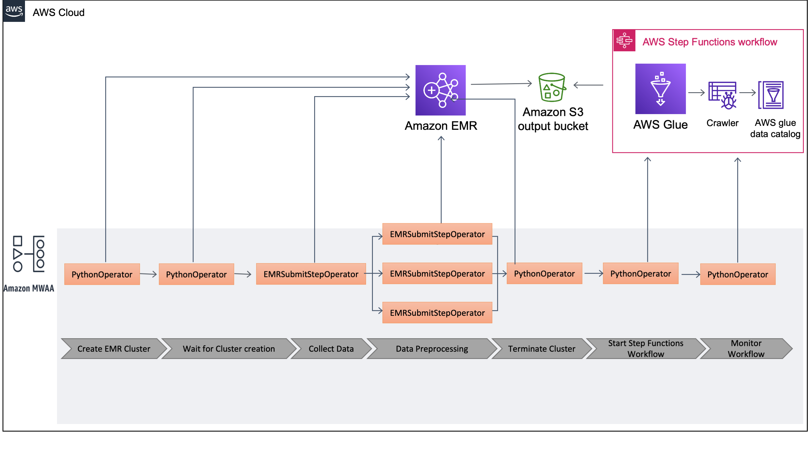

# Build complex workflows with Amazon MWAA,AWS Step Functions ,AWS Glue and Amazon EMR

Important: this application uses various AWS services and there are costs associated with these services after the Free Tier usage - please see the [AWS Pricing page](https://aws.amazon.com/pricing/) for details. You are responsible for any AWS costs incurred. No warranty is implied in this example.

## Code repo structure

```bash
.
├── README.MD                   <-- The instructions file
├── dags/mwaalib                <-- Reusable code for Amazon EMR and AWS Step Functions
├── setup                       <-- Source code for initial setup
│   └── transform/              <-- Pre processing pyspark code and resuable code.     
│   └── template.yaml           <-- Template for basic application setup
│   └── deploy.sh               <-- Deploy Script 

```

## Requirements

* AWS CLI already configured with Administrator permission

## Architecture



## Prerequisites
1.  AWS Account .[Create an AWS account](https://portal.aws.amazon.com/gp/aws/developer/registration/index.html) if you do not already have one and login.
2.  Amazon Managed Workflow for Apache Airflow environment in supported region.[Create environment](https://us-west-2.console.aws.amazon.com/mwaa/home?region=us-west-2#/create/environment) if you do not have one. Note us-west-2 is selected. Change the region, if required.
3.  IAM permissions for the MWAA Execution role for S3 ,EMR, Step Functions and AWS Systems Manager Parameter Store.

        elasticmapreduce:RunJobFlow
        iam:PassRole on EMR_DEFAULT_ROLE
        iam:PassRole on EMR_EC2_ROLE
        states:DescribeStateMachineForExecution
        states:DescribeStateMachine
        states:DescribeExecution
        states:StartExecution
        ssm:GetParameters
        ssm:GetParameter

 
 A sample [Policy](setup/additional_policy.json) is provided as an example. Verify and edit the Account Number to your AWS Account Number.
 Create and Attach the Policy to the Amazon MWAA execution role. 
 
 Refer to this [link](https://docs.aws.amazon.com/IAM/latest/UserGuide/access_policies_manage-attach-detach.html) for Adding and removing IAM identity permissions.
 
 A sample role yaml is also provided if you do not have EMR_DEFAULT_ROLE and EMR_EC2_ROLE already created. 
 Run the Cloudformation template to create [EMR Roles](setup/default-emr-roles.yaml)
 
 

## Installation Instructions

1. [Create an AWS account](https://portal.aws.amazon.com/gp/aws/developer/registration/index.html) if you do not already have one and login.
2. Clone the repo onto your local development machine using `git clone`.
3. From the command line, change directory into the ```setup``` folder, then run:
    ```
    ./deploy.sh -s <MWAA Airflow Dag Bucket Name> -d <Demo Data Bucket Name>

    ```
   
   Replace `<MWAA Airflow Dag Bucket Name> ` with the MWAA Airflow S3 Bucket
   
   Replace `<Demo Data Bucket Name> ` with any bucket you want to use.
   
   Modify the stack-name or bucket parameters as needed. Wait for the stack to complete.

4. Wait for the script to complete. You should see the following logs.
    ```
    Waiting for stack update to complete ...
    Finished create/update successfully!
    upload: ./movielens_glue_transform.py to s3://mwaa-dl-demo-us-east-1/scripts/glue_jobs/movielens/movielens_glue_transform.py
    upload: transform/preprocess_movies.py to s3://mwaa-dl-demo-us-east-1/scripts/preprocess_movies.py
    upload: transform/preprocess_tags.py to s3://mwaa-dl-demo-us-east-1/scripts/preprocess_tags.py
    upload: transform/preprocess_ratings.py to s3://mwaa-dl-demo-us-east-1/scripts/preprocess_ratings.py
    ...
    ```

## Post Installation Checks
1. Verify the resources created by the Cloudformation template.
2. Verify that Amazon MWAA execution role has [additional policy](setup/additional_policy.json) attached.
3. The deploy script creates a Glue Database and 2 crawlers. If you have [Lakeformation](https://aws.amazon.com/lake-formation/) enabled, please make sure to add the LF database grant to the crawler.

## AWS resources :
Following stacks are created by the above process
1. ```mwaa-demo-foundations``` - Contains the foundational resources and services 
    * Glue Database - mwaa-movielens-demo-db
    * Glue Crawlers  - Crawlers to catalog the data.
    * Lambda Functions - To invoke Glue jobs and check status from Step Functions  
    * LambdaRole - Lambda role for Step1 and Step2
    * SSM Parameters -  SSM parameters for resources to be used by all services.
    * Step Functions -  Movie Lens Step function
   


## AWS resources created based on DAG Run:
1. EMR Cluster

## Security

See [CONTRIBUTING](CONTRIBUTING.md#security-issue-notifications) for more information.

## License

This library is licensed under the MIT-0 License. See the LICENSE file.

